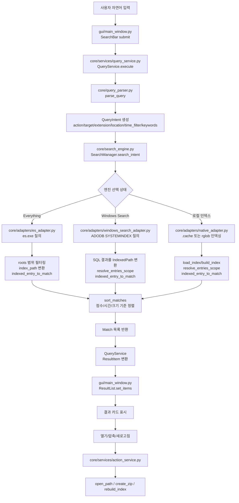
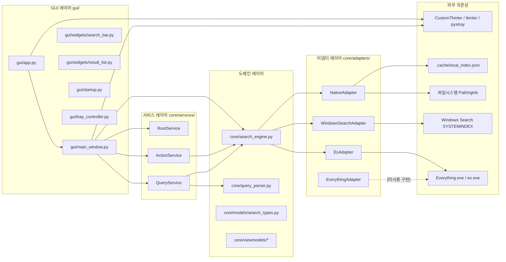
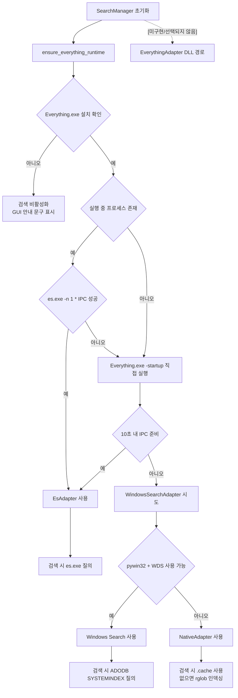

# ARCHITECTURE

전체 흐름

```mermaid
flowchart TD
    A[사용자 자연어 입력] --> B[gui/main_window.py\nSearchBar submit]
    B --> C[core/services/query_service.py\nQueryService.execute]
    C --> D[core/query_parser.py\nparse_query]
    D --> E[QueryIntent 생성\naction/target/extension/location/time_filter/keywords]
    E --> F[core/search_engine.py\nSearchManager.search_intent]
    F --> G{엔진 선택 상태}
    G -->|Everything| H[core/adapters/es_adapter.py\nes.exe 질의]
    G -->|Windows Search| I[core/adapters/windows_search_adapter.py\nADODB SYSTEMINDEX 질의]
    G -->|로컬 인덱스| J[core/adapters/native_adapter.py\n.cache 또는 rglob 인덱싱]
    H --> H2[roots 범위 필터링\nindex_path 변환\nindexed_entry_to_match]
    I --> I2[SQL 결과를 IndexedPath 변환\nresolve_entries_scope\nindexed_entry_to_match]
    J --> J2[load_index/build_index\nresolve_entries_scope\nindexed_entry_to_match]
    H2 --> K[sort_matches\n점수/시간/크기 기준 정렬]
    I2 --> K
    J2 --> K
    K --> L[Match 목록 반환]
    L --> M[QueryService\nResultItem 변환]
    M --> N[gui/main_window.py\nResultList.set_items]
    N --> O[결과 카드 표시]
    O --> P[열기/압축/새로고침]
    P --> Q[core/services/action_service.py]
    Q --> R[open_path / create_zip / rebuild_index]
```

레이어 구조

```mermaid
flowchart LR
    subgraph GUI[GUI 레이어 gui/]
        A1[gui/app.py]
        A2[gui/main_window.py]
        A3[gui/widgets/search_bar.py]
        A4[gui/widgets/result_list.py]
        A5[gui/startup.py]
        A6[gui/tray_controller.py]
    end

    subgraph SERVICE[서비스 레이어 core/services/]
        B1[QueryService]
        B2[ActionService]
        B3[RootService]
    end

    subgraph DOMAIN[도메인 레이어]
        C1[core/query_parser.py]
        C2[core/search_engine.py]
        C3[core/models/search_types.py]
        C4[core/viewmodels/*]
    end

    subgraph ADAPTER[어댑터 레이어 core/adapters/]
        D1[EsAdapter]
        D2[WindowsSearchAdapter]
        D3[NativeAdapter]
        D4[EverythingAdapter]
    end

    subgraph EXTERNAL[외부 의존성]
        E1[Everything.exe / es.exe]
        E2[Windows Search SYSTEMINDEX]
        E3[파일시스템 Path/rglob]
        E4[.cache/local_index.json]
        E5[CustomTkinter / tkinter / pystray]
    end

    A1 --> A2
    A2 --> B1
    A2 --> B2
    A2 --> B3
    A2 --> C2
    B1 --> C1
    B1 --> C2
    B2 --> C2
    C2 --> D1
    C2 --> D2
    C2 --> D3
    D1 --> E1
    D2 --> E2
    D3 --> E3
    D3 --> E4
    A1 --> E5
    A2 --> E5
    D4 -. [미사용 구현] .-> E1
```

검색 엔진 선택 흐름

```mermaid
flowchart TD
    A[SearchManager 초기화] --> B[ensure_everything_runtime]
    B --> C{Everything.exe 설치 확인}
    C -->|아니오| D[검색 비활성화\nGUI 안내 문구 표시]
    C -->|예| E{실행 중 프로세스 존재}
    E -->|예| F{es.exe -n 1 * IPC 성공}
    E -->|아니오| H[Everything.exe -startup 직접 실행]
    F -->|예| G[EsAdapter 사용]
    F -->|아니오| H
    H --> I{10초 내 IPC 준비}
    I -->|예| G
    I -->|아니오| J[WindowsSearchAdapter 시도]
    J --> K{pywin32 + WDS 사용 가능}
    K -->|예| L[Windows Search 사용]
    K -->|아니오| M[NativeAdapter 사용]

    G --> N[검색 시 es.exe 질의]
    L --> O[검색 시 ADODB SYSTEMINDEX 질의]
    M --> P[검색 시 .cache 사용\n없으면 rglob 인덱싱]

    A -. [미구현/선택되지 않음] .-> Q[EverythingAdapter DLL 경로]
```
