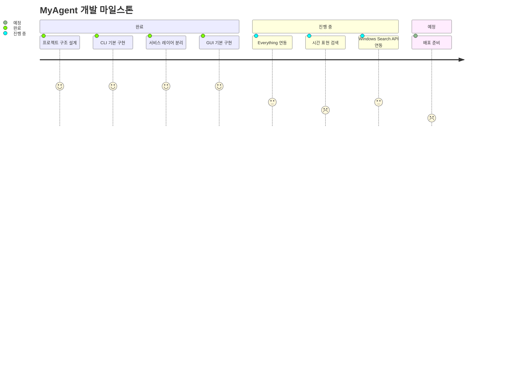

# STATUS

## 1. 목표
이 프로젝트는 자연어로 Windows 로컬 파일을 검색하고, 결과를 GUI/CLI에서 확인한 뒤 열기·압축·인덱스 새로고침까지 이어서 수행하는 데스크탑 앱을 만드는 것이 목표다. 검색 엔진은 Everything을 우선 사용하고, 실패 시 Windows Search와 로컬 인덱스로 내려가도록 설계돼 있다.

## 2. 현재 상황
동작하는 것
- GUI와 CLI 두 진입점이 모두 존재한다.
- `query_parser`가 액션, 확장자, 위치 힌트, 시간 필터, 결과 개수, 제외어를 `QueryIntent`로 변환한다.
- 검색 엔진 우선순위는 `Everything -> Windows Search -> 로컬 인덱스`로 구현돼 있다.
- GUI에서 드라이브 선택, 결과 카드 표시, 열기/압축/새로고침, 트레이 숨김이 구현돼 있다.
- Everything 미설치 시 검색 버튼 비활성화와 설치 안내 링크 표시가 구현돼 있다.

동작하지 않거나 검증 안 된 것
- 현재 환경에서 `pywin32` 미설치 상태라 Windows Search fallback을 실행 검증하지 못했다.
- Everything 직접 spawn 후 IPC 연결 성공/실패 및 종료 시 정리 동작은 실기 검증이 남아 있다.
- `EverythingAdapter` DLL 경로는 코드에 남아 있지만 현재 `SearchManager` 선택 경로에서는 사용되지 않는다.
- 시간 표현 검색은 코드상 필터 연결은 있으나 실제 사용자 표현 기준 정확도 검증이 부족하다.

## 3. 문제
Everything 연동 문제
- [확인됨] `ensure_everything_runtime()`는 실행 중인 `Everything.exe`를 찾더라도 `es.exe -n 1 *` IPC 테스트 실패 시 기존 프로세스를 종료하고 다시 spawn한다.
- [확인됨] 코드 주석은 없지만 현재 런타임 설계상 IPC 성공 조건이 `es.exe` 하나에 묶여 있어, 프로세스가 살아 있어도 IPC 실패면 Everything 경로 전체가 실패 처리된다.
- [예상] `Everything.ini`의 `run_as_admin=1`로 Everything과 앱 권한 레벨이 다르면 IPC 실패가 날 가능성이 높다. 코드에는 권한 레벨 보정 로직이 없다.
- [예상] `EverythingAdapter`는 별도 DLL을 로드하므로 설치된 Everything 버전과 `libs/Everything*.dll`이 다르면 DLL 경로 사용 시 실패할 가능성이 있다. 다만 현재 선택 경로에서는 DLL 어댑터를 쓰지 않는다.
- [확인됨] Everything과 Windows Search가 모두 실패하면 `NativeAdapter.build_index()`가 선택된 루트 전체를 `rglob("*")`로 순회한다.
- [예상] 드라이브 전체를 루트로 잡은 상태에서 native fallback이 발생하면 대규모 스캔 때문에 매우 오래 걸릴 수 있다. 제시된 `662초` 수치는 현재 코드만으로 재현 확인하지 못했다.

파서 문제
- [확인됨] `_extract_time_filter()`는 `오늘`, `어제`, `이번 주`, `지난주`, `이번 달`, `최근 N일`을 `intent.time_filter`로 변환한다.
- [확인됨] `NativeAdapter.matches_time_filter()`와 `WindowsSearchAdapter._build_date_filter()`는 `intent.time_filter`를 실제 필터에 연결한다.
- [확인됨] `EsAdapter`와 `EverythingAdapter`도 최종적으로 `indexed_entry_to_match()`를 거치므로 시간 필터 자체는 후처리 단계에 연결돼 있다.
- [확인됨] `_keywords_from_command()`는 시간 표현과 `파일` 같은 일반어는 제거하지만 `작업한` 같은 서술어는 제거하지 않는다.
- [예상] `"오늘 작업한 파일"`, `"이번 주 작업한 파일"` 같은 질의는 시간 필터보다 `작업한` 키워드가 먼저 후보를 좁혀 실제 검색 결과가 거의 없거나 부정확해질 수 있다.

## 4. 다음에 할 것
1. `pywin32`를 설치한 환경에서 Everything 실패 시 Windows Search fallback이 실제로 동작하는지 검증한다.
2. Everything 권한 레벨과 `run_as_admin` 설정을 맞춰 IPC 실패 원인을 분리한다.
3. 시간 표현 질의에서 `작업한`, `수정한` 같은 키워드를 제거하거나 별도 의미로 해석하도록 파서를 보정한다.
4. native fallback이 드라이브 전체 스캔으로 내려가지 않도록 캐시 정책이나 범위 제한을 추가 검토한다.

## 5. 남은 구현사항
- Windows Search fallback 실환경 검증
- Everything spawn/종료 수명주기 검증
- 시간 표현 검색 품질 개선
- 드라이브 선택 상태 재시작 복원
- README/문서 스크린샷 추가
- DLL 기반 Everything 경로 정리 또는 제거 여부 결정 (부분)
- 배포용 패키징 검증

## 6. 마일스톤

